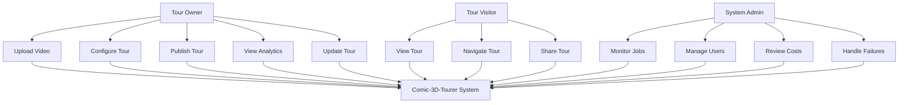
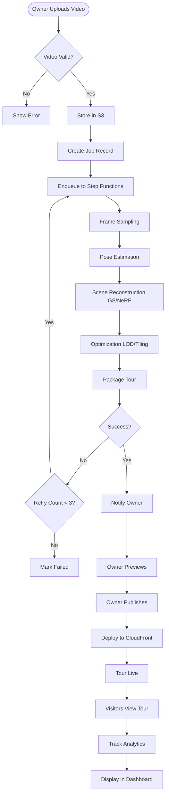
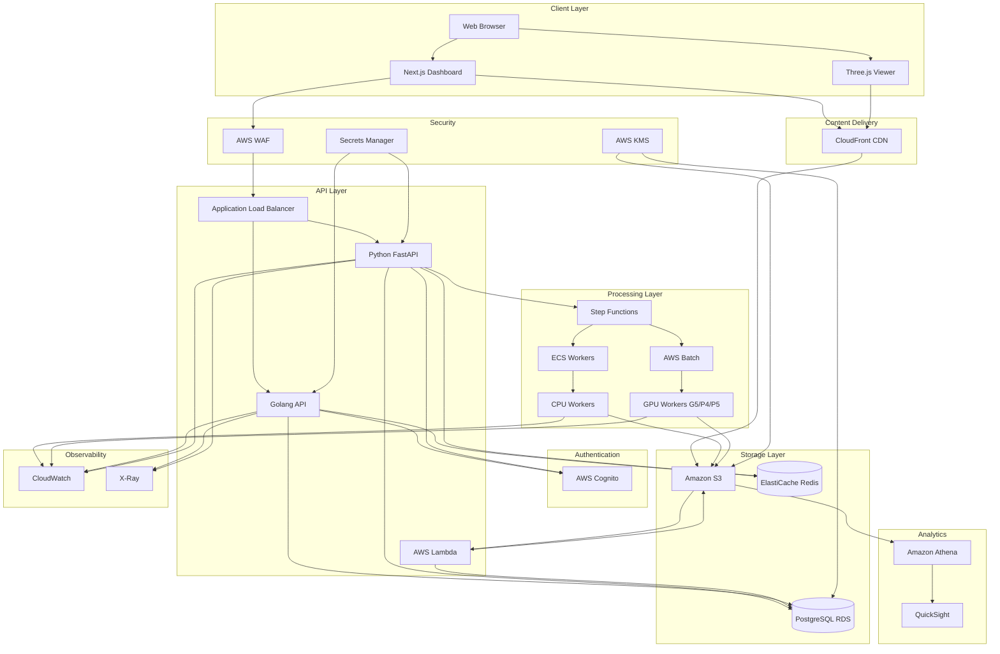

# Design Document: Comic-3D-Tourer

## High-Level Architecture

Comic-3D-Tourer is built on AWS cloud infrastructure with a microservices architecture. The system consists of:

1. **Frontend Layer**: Next.js/React dashboard and Three.js-based viewer
2. **API Layer**: FastAPI (Python) for ML operations, Golang for core infrastructure
3. **Processing Layer**: GPU-accelerated workers orchestrated by Step Functions
4. **Storage Layer**: S3 for objects, RDS for relational data, ElastiCache for caching
5. **Delivery Layer**: CloudFront CDN for global tour distribution
6. **Security Layer**: Cognito, IAM, KMS, WAF for comprehensive protection
7. **Observability Layer**: CloudWatch, X-Ray, QuickSight for monitoring and analytics

### Component Responsibilities

**Frontend (Next.js/React)**
- User authentication and session management
- Project and tour management UI
- Video upload with progress tracking
- Analytics dashboard
- Admin operations interface

**Viewer (Three.js/WebGL)**
- Real-time tour rendering
- Progressive loading and streaming
- Device-adaptive quality
- Navigation controls
- Embed SDK for third-party integration

**FastAPI (Python)**
- ML pipeline orchestration
- Frame sampling and quality assessment
- Integration with GS/NeRF libraries
- Job status management
- Webhook handling

**Golang API**
- High-throughput request handling
- Tour metadata serving
- Authentication and authorization
- Rate limiting
- Signed URL generation

**AWS Lambda**
- Thumbnail generation
- Webhook dispatching
- Lightweight data transformations
- S3 event processing

**Step Functions**
- Pipeline orchestration (preprocess → train → optimize → publish)
- Error handling and retries
- State management
- Parallel execution coordination

**EKS/ECS Workers**
- CPU workers: frame extraction, validation, packaging
- GPU workers: pose estimation, GS/NeRF training, optimization

**AWS Batch**
- GPU job scheduling
- Resource allocation
- Queue management
- Spot instance integration

## Detailed Pipeline Design

### Stage 1: Upload and Ingest

**Flow:**
1. User uploads video via Next.js frontend
2. Frontend requests presigned S3 URL from Golang API
3. Video uploaded directly to S3 (bypassing backend)
4. S3 event triggers Lambda to validate video
5. Lambda creates job record in RDS and enqueues to Step Functions

**S3 Key Structure:**
```
projects/{project_id}/raw/{job_id}/video.mp4
```

**Validation Checks:**
- File format (MP4, MOV, AVI)
- Resolution ≥1080p
- Frame rate ≥24fps
- Duration 1-30 minutes
- File size ≤10GB

### Stage 2: Frame Sampling

**Flow:**
1. Step Functions invokes CPU worker (ECS task)
2. Worker downloads video from S3
3. Extract frames at 2fps initially
4. Apply quality filters:
   - Blur detection (Laplacian variance)
   - Brightness/contrast analysis
   - Motion blur detection
   - Redundancy removal (perceptual hashing)
5. Select best 500-2000 frames
6. Upload frames to S3
7. Update job status in RDS and Redis

**S3 Key Structure:**
```
projects/{project_id}/frames/{job_id}/{frame_number}.jpg
```

**Output:**
- Selected frames (JPEG, 1080p)
- Frame metadata JSON (timestamps, quality scores)

### Stage 3: Pose Estimation

**Flow:**
1. Step Functions invokes GPU worker (AWS Batch)
2. Worker downloads frames from S3
3. Run COLMAP or similar for Structure-from-Motion:
   - Feature extraction (SIFT/ORB)
   - Feature matching
   - Sparse reconstruction
   - Camera pose estimation
4. Generate camera parameters file
5. Upload results to S3
6. Update job status

**S3 Key Structure:**
```
projects/{project_id}/poses/{job_id}/cameras.json
projects/{project_id}/poses/{job_id}/sparse_model/
```

**Output:**
- Camera intrinsics and extrinsics
- Sparse point cloud
- Pose confidence scores

### Stage 4: Scene Reconstruction (GS/NeRF)

**Flow:**
1. Step Functions invokes GPU worker (AWS Batch, P4/P5 instance)
2. Worker downloads frames and poses from S3
3. Train Gaussian Splatting or NeRF model:
   - Initialize scene representation
   - Iterative optimization (5000-30000 iterations)
   - Checkpoint every 1000 iterations
   - Monitor convergence (PSNR, SSIM)
4. Export trained model
5. Upload to S3
6. Update job status

**S3 Key Structure:**
```
projects/{project_id}/models/{job_id}/model.ply (GS)
projects/{project_id}/models/{job_id}/model.pth (NeRF)
```

**Training Parameters:**
- Batch size: 4-8 rays per pixel
- Learning rate: 1e-3 with decay
- Regularization: total variation, sparsity
- Early stopping: PSNR plateau detection

### Stage 5: Optimization

**Flow:**
1. Step Functions invokes GPU worker
2. Worker downloads trained model from S3
3. Apply optimizations:
   - **Compression**: Quantize model weights (FP32 → FP16 or INT8)
   - **LOD Generation**: Create 3-5 quality levels (high, medium, low)
   - **Spatial Tiling**: Divide scene into 4x4 or 8x8 grid
   - **Culling**: Remove invisible geometry
4. Generate optimized assets per LOD and tile
5. Upload to S3
6. Update job status

**S3 Key Structure:**
```
projects/{project_id}/optimized/{job_id}/lod_{level}/tile_{x}_{y}.bin
```

**LOD Strategy:**
- High: Full quality, desktop only
- Medium: 70% quality, default for desktop
- Low: 40% quality, mobile devices
- Thumbnail: 10% quality, preview

### Stage 6: Packaging

**Flow:**
1. Step Functions invokes CPU worker
2. Worker generates tour manifest:
   - Asset references (LOD, tiles)
   - Camera bounds and initial position
   - Metadata (title, description, privacy)
   - Viewer configuration
3. Generate thumbnail images (multiple angles)
4. Create viewer bundle (HTML + JS + assets)
5. Upload manifest and assets to S3
6. Invalidate CloudFront cache
7. Update job status to "completed"

**S3 Key Structure:**
```
projects/{project_id}/tours/{job_id}/manifest.json
projects/{project_id}/tours/{job_id}/thumbnails/preview_{angle}.jpg
projects/{project_id}/tours/{job_id}/viewer/index.html
```

**Manifest Schema:**
```json
{
  "version": "1.0",
  "project_id": "uuid",
  "job_id": "uuid",
  "created_at": "ISO8601",
  "camera": {
    "initial_position": [x, y, z],
    "bounds": {"min": [x,y,z], "max": [x,y,z]}
  },
  "assets": {
    "lod_high": ["tile_0_0.bin", ...],
    "lod_medium": ["tile_0_0.bin", ...],
    "lod_low": ["tile_0_0.bin", ...]
  },
  "metadata": {
    "title": "string",
    "privacy": "public|private",
    "password_protected": false
  }
}
```

### Stage 7: Publishing

**Flow:**
1. User clicks "Publish" in dashboard
2. Golang API generates unique tour URL
3. API creates CloudFront signed URL (if private)
4. API updates tour status to "published" in RDS
5. API returns shareable link and embed code
6. Frontend displays publish confirmation

**Tour URL Format:**
```
https://tours.comic3d.com/{tour_id}
https://cdn.comic3d.com/tours/{project_id}/{job_id}/viewer/
```

**Embed Code:**
```html
<iframe src="https://tours.comic3d.com/{tour_id}" 
        width="800" height="600" 
        frameborder="0" allowfullscreen>
</iframe>
```

## Orchestration Strategy

### Step Functions State Machine

**States:**
1. **ValidateInput**: Check video metadata
2. **SampleFrames**: Extract and filter frames (CPU worker)
3. **EstimatePoses**: Run SfM pipeline (GPU worker)
4. **ReconstructScene**: Train GS/NeRF (GPU worker)
5. **OptimizeModel**: Compress and generate LODs (GPU worker)
6. **PackageTour**: Create manifest and viewer (CPU worker)
7. **NotifyCompletion**: Send webhook/email

**Error Handling:**
- Each state has retry policy (max 3 attempts, exponential backoff)
- Catch blocks for specific errors (GPU OOM, S3 access denied)
- Fallback states for graceful degradation
- Dead letter queue for unrecoverable failures

**Idempotency:**
- Each state checks Redis for completion status
- S3 keys include job_id to prevent collisions
- Database updates use optimistic locking

**Job Resume:**
- State machine execution ARN stored in RDS
- On failure, user can trigger resume from last successful state
- Checkpoints stored in S3 for long-running states (training)

### Job Queue and Worker Pools

**Queue Architecture:**
- SQS queue per worker type (cpu_queue, gpu_queue)
- Priority queues for premium customers
- Dead letter queue for failed jobs

**Worker Pools:**
- **CPU Pool**: ECS Fargate tasks, auto-scale 10-100 instances
- **GPU Pool**: AWS Batch with EC2 Spot instances (G5/P4), 5-50 instances

**Auto-scaling Triggers:**
- Scale up: Queue depth >10 messages for >5 minutes
- Scale down: Queue depth <2 messages for >10 minutes
- GPU pool: Prefer Spot instances, fallback to On-Demand if unavailable

**Resource Allocation:**
- CPU tasks: 4 vCPU, 8GB RAM
- GPU tasks: 16 vCPU, 64GB RAM, 1-4 GPUs (depending on stage)

## Data Design

### PostgreSQL Schema

**users**
```sql
CREATE TABLE users (
  id UUID PRIMARY KEY,
  email VARCHAR(255) UNIQUE NOT NULL,
  cognito_sub VARCHAR(255) UNIQUE NOT NULL,
  name VARCHAR(255),
  role VARCHAR(50) DEFAULT 'owner',
  created_at TIMESTAMP DEFAULT NOW(),
  updated_at TIMESTAMP DEFAULT NOW()
);
```

**projects**
```sql
CREATE TABLE projects (
  id UUID PRIMARY KEY,
  user_id UUID REFERENCES users(id) ON DELETE CASCADE,
  title VARCHAR(255) NOT NULL,
  description TEXT,
  privacy VARCHAR(20) DEFAULT 'private',
  password_hash VARCHAR(255),
  created_at TIMESTAMP DEFAULT NOW(),
  updated_at TIMESTAMP DEFAULT NOW()
);
```

**jobs**
```sql
CREATE TABLE jobs (
  id UUID PRIMARY KEY,
  project_id UUID REFERENCES projects(id) ON DELETE CASCADE,
  status VARCHAR(50) DEFAULT 'pending',
  stage VARCHAR(50),
  progress INT DEFAULT 0,
  error_message TEXT,
  execution_arn VARCHAR(500),
  video_s3_key VARCHAR(500),
  manifest_s3_key VARCHAR(500),
  created_at TIMESTAMP DEFAULT NOW(),
  updated_at TIMESTAMP DEFAULT NOW(),
  completed_at TIMESTAMP
);
```

**tours**
```sql
CREATE TABLE tours (
  id UUID PRIMARY KEY,
  project_id UUID REFERENCES projects(id) ON DELETE CASCADE,
  job_id UUID REFERENCES jobs(id),
  version INT DEFAULT 1,
  status VARCHAR(50) DEFAULT 'draft',
  tour_url VARCHAR(500) UNIQUE,
  manifest_s3_key VARCHAR(500),
  thumbnail_s3_key VARCHAR(500),
  published_at TIMESTAMP,
  created_at TIMESTAMP DEFAULT NOW()
);
```

**permissions**
```sql
CREATE TABLE permissions (
  id UUID PRIMARY KEY,
  project_id UUID REFERENCES projects(id) ON DELETE CASCADE,
  user_id UUID REFERENCES users(id) ON DELETE CASCADE,
  role VARCHAR(50) DEFAULT 'viewer',
  created_at TIMESTAMP DEFAULT NOW()
);
```

**analytics_summary**
```sql
CREATE TABLE analytics_summary (
  id UUID PRIMARY KEY,
  tour_id UUID REFERENCES tours(id) ON DELETE CASCADE,
  date DATE NOT NULL,
  views INT DEFAULT 0,
  unique_visitors INT DEFAULT 0,
  avg_duration_seconds INT DEFAULT 0,
  device_mobile INT DEFAULT 0,
  device_desktop INT DEFAULT 0,
  UNIQUE(tour_id, date)
);
```

**Indexes:**
```sql
CREATE INDEX idx_projects_user_id ON projects(user_id);
CREATE INDEX idx_jobs_project_id ON jobs(project_id);
CREATE INDEX idx_jobs_status ON jobs(status);
CREATE INDEX idx_tours_project_id ON tours(project_id);
CREATE INDEX idx_analytics_tour_date ON analytics_summary(tour_id, date);
```

### S3 Key Layout

**Structure:**
```
/projects/{project_id}/
  /raw/{job_id}/
    video.mp4
  /frames/{job_id}/
    {frame_number}.jpg
    metadata.json
  /poses/{job_id}/
    cameras.json
    sparse_model/
  /models/{job_id}/
    model.ply (or model.pth)
    checkpoints/
  /optimized/{job_id}/
    lod_high/tile_{x}_{y}.bin
    lod_medium/tile_{x}_{y}.bin
    lod_low/tile_{x}_{y}.bin
  /tours/{job_id}/
    manifest.json
    thumbnails/preview_{angle}.jpg
    viewer/index.html
```

**Versioning:**
- Enable S3 versioning for tours/ to support rollback
- Keep last 5 versions, delete older

**Lifecycle Policies:**
- Move raw videos to Glacier after 90 days
- Move frames to Glacier after 30 days
- Delete checkpoints after 7 days
- Keep tours indefinitely (or until project deleted)

### Redis Key and TTL Strategy

**Key Patterns:**
```
job:{job_id}:status          -> JSON (TTL: 24h after completion)
job:{job_id}:progress        -> INT (TTL: 24h after completion)
tour:{tour_id}:manifest      -> JSON (TTL: 1h)
tour:{tour_id}:permissions   -> JSON (TTL: 15m)
user:{user_id}:session       -> JSON (TTL: 1h)
signed_url:{tour_id}         -> STRING (TTL: 5m)
rate_limit:{user_id}:{api}   -> INT (TTL: 1m)
```

**Cache Strategy:**
- Write-through for job status updates
- Cache-aside for tour manifests
- Lazy loading for permissions
- Invalidate on updates (publish, privacy change)

### Analytics Event Model

**Event Schema (stored in S3 as JSON lines):**
```json
{
  "event_id": "uuid",
  "event_type": "tour_view|interaction|exit",
  "tour_id": "uuid",
  "visitor_id": "uuid",
  "timestamp": "ISO8601",
  "session_id": "uuid",
  "device_type": "mobile|desktop",
  "browser": "string",
  "location": {"country": "string", "city": "string"},
  "data": {
    "duration_seconds": 120,
    "interactions": 15,
    "nodes_visited": ["node1", "node2"]
  }
}
```

**Storage Pattern:**
```
/analytics/events/year={YYYY}/month={MM}/day={DD}/hour={HH}/{uuid}.json
```

**Athena Table:**
```sql
CREATE EXTERNAL TABLE analytics_events (
  event_id STRING,
  event_type STRING,
  tour_id STRING,
  visitor_id STRING,
  timestamp STRING,
  session_id STRING,
  device_type STRING,
  browser STRING,
  location STRUCT<country:STRING, city:STRING>,
  data STRUCT<duration_seconds:INT, interactions:INT, nodes_visited:ARRAY<STRING>>
)
PARTITIONED BY (year STRING, month STRING, day STRING, hour STRING)
STORED AS JSON
LOCATION 's3://bucket/analytics/events/';
```

**QuickSight Dashboards:**
- Total views over time
- Unique visitors by geography
- Average session duration
- Device type distribution
- Most popular tours
- Engagement funnel

## API Design

### Core Endpoints

**Authentication**
```
POST /api/v1/auth/signup
POST /api/v1/auth/login
POST /api/v1/auth/logout
POST /api/v1/auth/refresh
GET  /api/v1/auth/me
```

**Projects**
```
POST   /api/v1/projects
GET    /api/v1/projects
GET    /api/v1/projects/{id}
PATCH  /api/v1/projects/{id}
DELETE /api/v1/projects/{id}
```

**Upload**
```
POST /api/v1/projects/{id}/upload/init
  Request: {"filename": "video.mp4", "size": 1024000}
  Response: {"upload_id": "uuid", "presigned_url": "s3://..."}

POST /api/v1/projects/{id}/upload/complete
  Request: {"upload_id": "uuid"}
  Response: {"job_id": "uuid", "status": "queued"}
```

**Jobs**
```
GET /api/v1/jobs/{id}
  Response: {
    "id": "uuid",
    "status": "processing",
    "stage": "pose_estimation",
    "progress": 45,
    "estimated_completion": "ISO8601"
  }

POST /api/v1/jobs/{id}/retry
POST /api/v1/jobs/{id}/cancel
GET  /api/v1/jobs/{id}/logs
```

**Tours**
```
GET    /api/v1/tours/{id}
PATCH  /api/v1/tours/{id}
POST   /api/v1/tours/{id}/publish
DELETE /api/v1/tours/{id}
GET    /api/v1/tours/{id}/analytics
GET    /api/v1/tours/{id}/embed-code
```

**Analytics**
```
GET /api/v1/analytics/tours/{id}
  Query: ?start_date=YYYY-MM-DD&end_date=YYYY-MM-DD
  Response: {
    "views": 1234,
    "unique_visitors": 567,
    "avg_duration": 180,
    "device_breakdown": {"mobile": 60, "desktop": 40}
  }

POST /api/v1/analytics/events
  Request: {"event_type": "tour_view", "tour_id": "uuid", ...}
  Response: {"status": "recorded"}
```

**WebSocket**
```
WS /api/v1/jobs/{id}/status
  Message: {
    "job_id": "uuid",
    "status": "processing",
    "stage": "reconstruction",
    "progress": 67,
    "message": "Training iteration 15000/30000"
  }
```

### Example Request/Response

**Create Project and Upload Video:**
```bash
# 1. Create project
curl -X POST https://api.comic3d.com/v1/projects \
  -H "Authorization: Bearer {token}" \
  -H "Content-Type: application/json" \
  -d '{"title": "My Store Tour", "description": "Virtual tour of retail space"}'

Response:
{
  "id": "proj_123",
  "title": "My Store Tour",
  "created_at": "2026-02-15T10:00:00Z"
}

# 2. Initialize upload
curl -X POST https://api.comic3d.com/v1/projects/proj_123/upload/init \
  -H "Authorization: Bearer {token}" \
  -d '{"filename": "store_walkthrough.mp4", "size": 524288000}'

Response:
{
  "upload_id": "upload_456",
  "presigned_url": "https://s3.amazonaws.com/bucket/...",
  "expires_at": "2026-02-15T11:00:00Z"
}

# 3. Upload to S3 (direct)
curl -X PUT "{presigned_url}" \
  --upload-file store_walkthrough.mp4

# 4. Complete upload
curl -X POST https://api.comic3d.com/v1/projects/proj_123/upload/complete \
  -H "Authorization: Bearer {token}" \
  -d '{"upload_id": "upload_456"}'

Response:
{
  "job_id": "job_789",
  "status": "queued",
  "estimated_duration": "4-6 hours"
}
```

## Security Design

### Authentication and Authorization

**Cognito Integration:**
- User pools for authentication
- Identity pools for AWS resource access
- MFA support (TOTP, SMS)
- Social login (Google, Facebook) optional
- JWT tokens with 1-hour expiration
- Refresh tokens with 30-day expiration

**IAM Boundaries:**
- Separate roles for frontend, backend, workers
- Least privilege principle
- Service-to-service authentication via IAM roles
- Cross-account access for multi-tenant isolation

**RBAC Model:**
```
Roles:
- owner: Full access to own projects
- collaborator: Edit access to shared projects
- viewer: Read-only access to shared projects
- admin: System-wide administrative access

Permissions:
- project:create, project:read, project:update, project:delete
- tour:publish, tour:unpublish, tour:analytics
- job:retry, job:cancel
- user:manage (admin only)
```

### Encryption

**At Rest (KMS):**
- S3 bucket encryption with customer-managed keys
- RDS encryption with automatic key rotation
- ElastiCache encryption enabled
- Secrets Manager for API keys and credentials

**In Transit (TLS 1.3):**
- CloudFront with TLS 1.3 minimum
- ALB with TLS 1.3 minimum
- Certificate management via ACM
- HSTS headers enforced

### Access Control

**Private Tours:**
- Signed URLs with expiration (default 1 hour)
- Optional password protection (bcrypt hashed)
- IP whitelisting for enterprise customers
- Referrer checking for embedded tours

**Signed URL Generation:**
```python
def generate_signed_url(tour_id: str, expiration: int = 3600) -> str:
    cloudfront_signer = CloudFrontSigner(key_id, private_key)
    url = f"https://cdn.comic3d.com/tours/{tour_id}/"
    expires = datetime.now() + timedelta(seconds=expiration)
    return cloudfront_signer.generate_presigned_url(url, date_less_than=expires)
```

### WAF Rules

**Protection Against:**
- SQL injection (SQLi)
- Cross-site scripting (XSS)
- Rate limiting (100 req/min per IP)
- Geographic blocking (optional)
- Known bad IPs (AWS managed rules)
- Large request bodies (>10MB blocked)

**Rate Limiting Strategy:**
```
Tier 1 (Free): 10 uploads/month, 1000 views/month
Tier 2 (Pro): 100 uploads/month, 50000 views/month
Tier 3 (Enterprise): Unlimited
```

### Audit Logging

**CloudTrail:**
- All API calls logged
- S3 bucket access logged
- IAM changes logged
- 90-day retention, then archive to Glacier

**Application Logs:**
- User authentication events
- Project/tour CRUD operations
- Job state transitions
- Admin actions
- Failed access attempts

## Observability

### CloudWatch Logs

**Log Groups:**
```
/aws/lambda/video-validator
/aws/ecs/cpu-workers
/aws/batch/gpu-workers
/aws/api/golang
/aws/api/fastapi
```

**Structured Logging Format:**
```json
{
  "timestamp": "ISO8601",
  "level": "INFO|WARN|ERROR",
  "service": "string",
  "trace_id": "string",
  "message": "string",
  "context": {}
}
```

### CloudWatch Metrics

**Custom Metrics:**
- `JobsQueued`: Number of jobs in queue
- `JobsProcessing`: Number of active jobs
- `JobDuration`: Time to complete job (by stage)
- `GPUUtilization`: GPU usage percentage
- `TourViews`: Number of tour views
- `APILatency`: API response time (p50, p95, p99)
- `CacheHitRate`: Redis cache hit ratio
- `CDNHitRate`: CloudFront cache hit ratio

### X-Ray Tracing

**Instrumentation:**
- All API requests traced end-to-end
- Step Functions execution traced
- S3 and RDS calls traced
- Custom segments for ML operations

**Trace Annotations:**
```
user_id, project_id, job_id, tour_id
stage, status, error_type
```

### Alerting

**Critical Alerts (PagerDuty):**
- Job failure rate >10% in 5 minutes
- API error rate >5% in 5 minutes
- GPU worker unavailable for >10 minutes
- Database connection failures
- S3 access errors

**Warning Alerts (Email):**
- Job queue depth >50 for >15 minutes
- CDN cache hit rate <80%
- API latency p95 >500ms
- Cost exceeds budget threshold

**SLO/SLA Targets:**
```
Availability: 99.5% uptime
API Latency: p95 <200ms, p99 <500ms
Job Completion: 95% within 24 hours
Tour Load Time: p95 <3 seconds
```

## Cost Optimization

### Spot Instances for GPU Workers

**Strategy:**
- Use Spot for 70% of GPU capacity
- On-Demand for remaining 30% (guaranteed capacity)
- Spot interruption handling: checkpoint and resume
- Diversify instance types (G5, P4, P5)

**Cost Savings:**
```
On-Demand g5.4xlarge: $1.624/hour
Spot g5.4xlarge: ~$0.487/hour (70% savings)
Monthly savings: ~$800/instance
```

### Caching Strategy

**ElastiCache:**
- Cache tour manifests (reduce S3 GET requests)
- Cache permissions (reduce RDS queries)
- Cache signed URLs (reduce computation)
- Target 90% cache hit rate

**CloudFront:**
- Cache tours for 24 hours
- Cache thumbnails for 7 days
- Cache static assets for 30 days
- Compress responses (gzip, brotli)

### LOD and Tiling

**Benefits:**
- Reduce initial payload size by 80%
- Load only visible tiles
- Adapt quality to device capabilities
- Reduce CDN egress costs

**Example:**
```
Full quality tour: 500MB
With LOD + tiling:
  - Initial load: 50MB (low LOD, center tiles)
  - Progressive load: 200MB (medium LOD, all tiles)
  - Full quality: 500MB (high LOD, on-demand)

CDN cost reduction: 60-80%
```

### S3 Lifecycle Policies

**Policy:**
```
Raw videos:
  - 0-30 days: S3 Standard
  - 30-90 days: S3 Infrequent Access
  - 90+ days: Glacier

Frames:
  - 0-7 days: S3 Standard
  - 7-30 days: S3 Infrequent Access
  - 30+ days: Delete

Checkpoints:
  - 0-7 days: S3 Standard
  - 7+ days: Delete

Tours:
  - Indefinite: S3 Standard (frequently accessed)
```

**Cost Impact:**
```
1TB raw videos:
  - S3 Standard: $23.55/month
  - Glacier: $4.10/month
  - Savings: $19.45/month per TB
```

## Failure Modes and Recovery

### GPU Worker Failure

**Scenarios:**
- Out of memory (OOM)
- Spot instance interruption
- Training divergence
- Hardware failure

**Recovery:**
- Checkpoint every 1000 iterations
- Resume from last checkpoint
- Retry with reduced batch size (OOM)
- Fallback to On-Demand instance (Spot interruption)
- Alert if 3 consecutive failures

### Database Failure

**Scenarios:**
- Primary instance failure
- Connection pool exhaustion
- Slow queries
- Disk full

**Recovery:**
- Multi-AZ deployment with automatic failover
- Read replicas for analytics queries
- Connection pooling with circuit breaker
- Query timeout (5 seconds)
- Automated backups (daily, 7-day retention)

### S3 Failure

**Scenarios:**
- Access denied
- Bucket not found
- Network timeout
- Rate limiting

**Recovery:**
- Retry with exponential backoff (3 attempts)
- Cross-region replication for critical data
- Fallback to alternative bucket
- Alert on persistent failures

### CDN Failure

**Scenarios:**
- Origin unreachable
- Cache invalidation failure
- Geographic routing issues

**Recovery:**
- Multiple origins (primary + backup)
- Stale-while-revalidate caching
- Automatic failover to backup origin
- Monitor origin health checks

### Step Functions Failure

**Scenarios:**
- State timeout
- Lambda throttling
- Worker unavailable
- Invalid state transition

**Recovery:**
- Timeout per state (configurable)
- Retry policy per state (max 3 attempts)
- Dead letter queue for manual intervention
- Resume from last successful state
- Notification on terminal failure

## Diagrams

### Use-Case Diagram



### Process Flow Diagram



### Architecture Diagram



## Assumptions and Cost Notes

### GPU Compute
- Example instance: g3.4xlarge (122GB RAM, 16 vCPU, $1.12/hour)
- Monthly cost (24/7 operation): 24h × 30d = $806.40/month
- Spot instances can reduce costs by ~70%
- Typical job uses GPU for 2-6 hours depending on video length
- Batch scheduling optimizes utilization across multiple jobs

### Caching
- Example instance: cache.m2.2xlarge (33.8GB RAM, 4 vCPU, $0.604/hour)
- Monthly cost (24/7 operation): 24h × 30d = $434.88/month
- Reduces database load by 80-90%
- Reduces S3 GET requests by 85%+
- Critical for real-time job status updates

### Storage (S3 Standard)
- Cost: ~$0.023/GB-month
- For 1TB (1024GB): $23.55/month
- Average tour size: 200-500MB (optimized)
- Raw video: 500MB-5GB (archived to Glacier after 90 days)
- Lifecycle policies reduce long-term storage costs by 80%

### Delivery (CloudFront CDN)
- Data transfer out: ~$0.085/GB (NA/EU) or ~$0.14/GB (Asia)
- For 1TB delivered: $87.04 (NA/EU) or $143.36 (Asia)
- Cache hit ratio target: 85%+
- LOD and tiling reduce egress by 60-80%
- Compression (gzip/brotli) reduces payload by 30-40%

### Cost Optimization Summary
- Spot instances for GPU: 70% savings on compute
- Aggressive caching: 85% reduction in origin requests
- S3 lifecycle policies: 80% savings on long-term storage
- LOD/tiling: 60-80% reduction in CDN egress
- Total estimated cost per tour: $5-15 (processing) + $0.50-2/month (storage + delivery)

### Scaling Assumptions
- 1000 tours/month: ~$10,000-15,000/month infrastructure
- 10,000 tours/month: ~$80,000-100,000/month infrastructure
- Economies of scale improve with volume (better Spot availability, CDN discounts)
